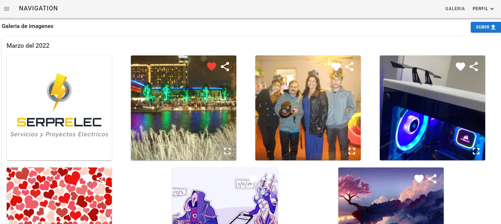

@author <orson.manuel@gmail.com>
@version 1.0.0
@description Galeria imagenes

# Galeria imagenes

Aplicacion para guardar imagenes en la nube, la cual se puden compartir y destacar como favoritas.

## Frontend dependencias

- vuejs
- Vuetify
- Vuex
- axios

## Backend dependencias

- nodejs
- expressjs
- mongoDB (mongoose)
- multer

## Screenshots

